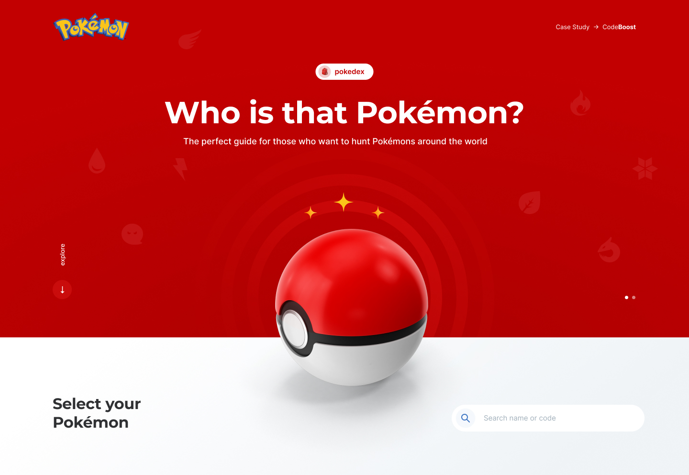
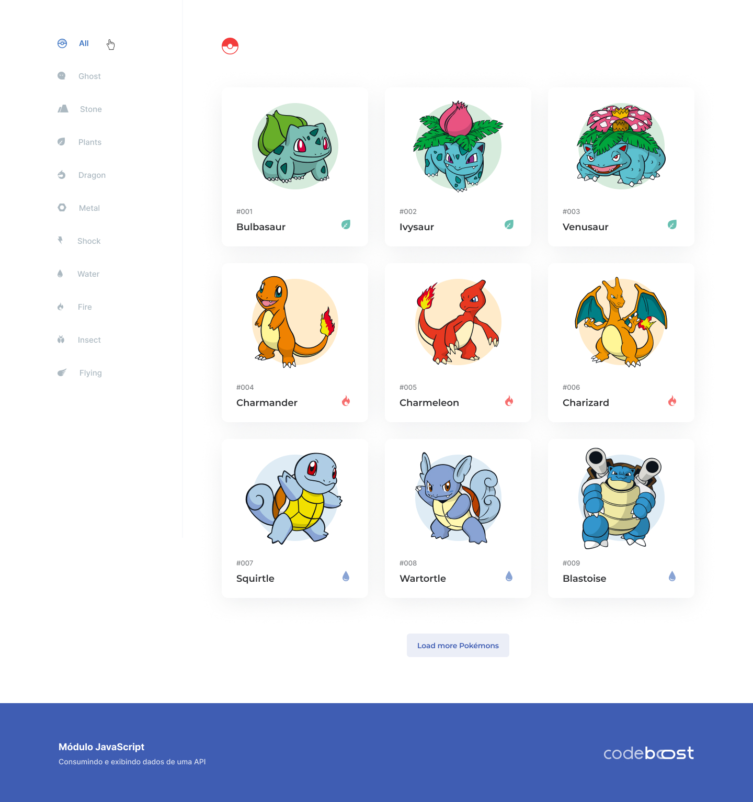

<h1 align="center">
    
</h1>

<h4 align="center"> 
	Projeto - Pokedex 🚀
</h4>

  
  
  

## 💻 Sobre o projeto
Uma Pokédex consumida da API PokeAPI é uma aplicação desenvolvida em JavaScript que busca informações sobre os Pokémon diretamente da API pública PokeAPI, que contém informações sobre os Pokémon, incluindo suas estatísticas, habilidades, tipos, evoluções e muito mais. Essa aplicação permite aos usuários pesquisar informações sobre um Pokémon específico ou explorar todos os Pokémon existentes.

### Mobile

  

### Web

  
  

## 🛠 Tecnologias

As seguintes ferramentas foram usadas na construção do projeto:

- [Javascript][js]

## 📝 Licença

Este projeto esta sobe a licença MIT.

Feito com ❤️ por Allan dos Reis  👋🏽 [Entre em contato!](https://www.linkedin.com/in/allan-dos-reis-535824207/)

[nodejs]: https://nodejs.org/
[yarn]: https://yarnpkg.com/
[vscode]: https://code.visualstudio.com/
[license]: https://opensource.org/licenses/MIT
[gulpjs]: https://gulpjs.com/
[js]: https://developer.mozilla.org/pt-BR/docs/Web/JavaScript
